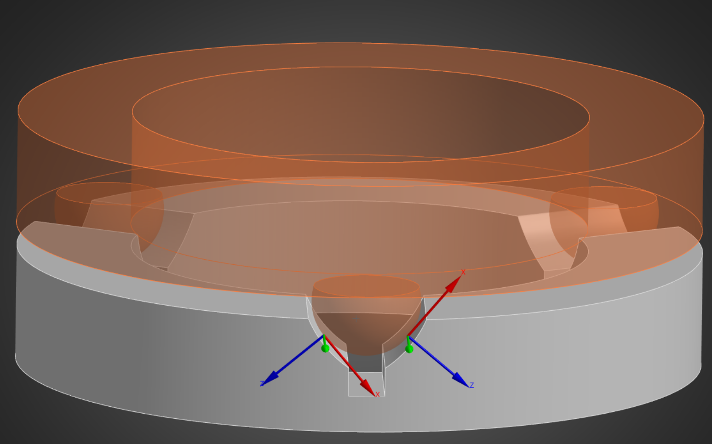

# ANSYS Mechanical Automation: Creating 6DOF Bushing Contacts

{width=80% fit-align="center"}

When solving a mechanical model, points of contact can become extremely computationally demanding, requiring a heavily refined mesh around the contact region to determine local behavior. For some analyses, however, we do not require an accurate local representation and care more about the overall stiffness between two components.

In this case, we can simplify the expensive contact region with a 6 degree-of-freedom bushing joint, allowing us to represent the connection without the need for an extremely fine mesh.

The challenge to this approach is placing the bushing correctly. With the automation script I wrote below, all of the geometry difficulties are taken care of. The user must select 2 bodies (sphere + cylinder) and the script places a bushing contact lined up along the vector from the center of the sphere and cylinder. 

(See end for notes about the code)

```python
import numpy as np

_start_vars = set(dir())

def checkJ(cons):
    for x in cons:
        if "Joint" in str(x.ConnectionType):
            return x
    return None
    
def det3(M):
    return M[0][0]*(M[1][1]*M[2][2] - M[1][2]*M[2][1]) - M[0][1]*(M[1][0]*M[2][2] - M[1][2]*M[2][0]) + M[0][2]*(M[1][0]*M[2][1] - M[1][1]*M[2][0])

globals()['det3'] = det3

def solve_3x3(A, B):
    D = det3(A)
    Ax = [
        [B[0], A[0][1], A[0][2]],
        [B[1], A[1][1], A[1][2]],
        [B[2], A[2][1], A[2][2]]
    ]

    Ay = [
        [A[0][0], B[0], A[0][2]],
        [A[1][0], B[1], A[1][2]],
        [A[2][0], B[2], A[2][2]]
    ]

    Az = [
        [A[0][0], A[0][1], B[0]],
        [A[1][0], A[1][1], B[1]],
        [A[2][0], A[2][1], B[2]]
    ]

    return [det3(Ax)/D, det3(Ay)/D, det3(Az)/D]

globals()['solve_3x3'] = solve_3x3
    
def sphere_center(p1, p2, p3, p4):
    x1, y1, z1 = p1
    A = []
    B = []
    for x, y, z in [p2, p3, p4]:
        A.append([2*(x - x1), 2*(y - y1), 2*(z - z1)])
        B.append(x*x + y*y + z*z - x1*x1 - y1*y1 - z1*z1)

    return solve_3x3(A, B)


globals()['sphere_center'] = sphere_center

selected = list(ExtAPI.SelectionManager.CurrentSelection)

if "Sphere" in str(ExtAPI.DataModel.GeoData.GeoEntityById(selected[0]).SurfaceType):
    cylID = selected[1]
    sphereID = selected[0]
else:
    cylID = selected[0]
    sphereID = selected[1]

sph = ExtAPI.DataModel.GeoData.GeoEntityById(sphereID)
cyl = ExtAPI.DataModel.GeoData.GeoEntityById(cylID)

sphere = sph.Points
norms = cyl.Normals

norms = np.array(norms).reshape(-1, 3)
sphere = np.array(sphere).reshape(-1, 3)

p1 = norms[2]
p2 = norms[7]
p3 = norms[14]

A = np.vstack((p1, p2, p3))

eigenvalues, Vectors = np.linalg.eig(A)
D = np.diag(eigenvalues)

U, s, Vt = np.linalg.svd(norms, full_matrices=True)
S = np.zeros((norms.shape[0], norms.shape[1]))
np.fill_diagonal(S, s)

dirCyl = np.array(Vt[2])

cs = Model.CoordinateSystems
cs1 = cs.AddCoordinateSystem()

selection = ExtAPI.SelectionManager.CreateSelectionInfo(SelectionTypeEnum.GeometryEntities)
selection.Ids = [cylID]

cs1.OriginLocation = selection

sphereCenter = np.array(sphere_center(sphere[0], sphere[10], sphere[20], sphere[30]))

cs1.PrimaryAxis = CoordinateSystemAxisType.PositiveZAxis
cs1.PrimaryAxisDirection = Vector3D(dirCyl[0], dirCyl[1], dirCyl[2])

pointOnCylAxis = np.array([
    float(str(cs1.OriginX).split(" ")[0]),
    float(str(cs1.OriginY).split(" ")[0]),
    float(str(cs1.OriginZ).split(" ")[0])
])

OP = np.array(pointOnCylAxis-sphereCenter)

AtoC = np.cross(np.cross(OP, dirCyl), dirCyl)

AtoC = AtoC / np.linalg.norm(AtoC)

actual_point = sphereCenter + sph.Radius*AtoC

cs1.OriginX = Quantity(str(actual_point[0]) + " [m]")
cs1.OriginY = Quantity(str(actual_point[1]) + " [m]")
cs1.OriginZ = Quantity(str(actual_point[2]) + " [m]")

cs1.PrimaryAxis = CoordinateSystemAxisType.PositiveZAxis
cs1.PrimaryAxisDirection = Vector3D(AtoC)

cs1.SecondaryAxis = CoordinateSystemAxisType.PositiveXAxis
cs1.SecondaryAxisDirection = Vector3D(dirCyl)

cons = Model.Connections.Children

group = checkJ(cons)

if checkJ(cons) is None:
    group = Model.Connections.AddConnectionGroup()

group.ConnectionType = AutoDetectionType.Joint

joint = group.AddJoint()
joint.Type = JointType.Bushing

rp1 = Model.RemotePoints.AddRemotePoint()
rp2 = Model.RemotePoints.AddRemotePoint()

selection = ExtAPI.SelectionManager.CreateSelectionInfo(SelectionTypeEnum.GeometryEntities)
selection.Ids = [cylID]

rp1.Location = selection

selection = ExtAPI.SelectionManager.CreateSelectionInfo(SelectionTypeEnum.GeometryEntities)
selection.Ids = [sphereID]

rp2.Location = selection

joint.ReferenceLocation = rp1
joint.MobileLocation = rp2

rp1.CoordinateSystem = cs2
rp2.CoordinateSystem = cs2

```
To see the actual math behind this: (INSERT HERE)

When it came to finding the center of the sphere, I recycled it from one of my older scripts before found out how to use CPython (numpy) in ansys mechanical so there are multiple technically not needed functions above that do smaller scale matrix operations.

Because CPython is still technically in beta, there are many weird bugs when it comes to compiling these scripts. In this code specifically, I had to force various functions to be considered global so I could access them at all using `globals()['sphere_center'] = sphere_center`.

If this code were to be used for a large amount of connections, I would recommend writing a function which sorts your selections into pairs based on centroid proximity and looping through these pairs with the above code.
